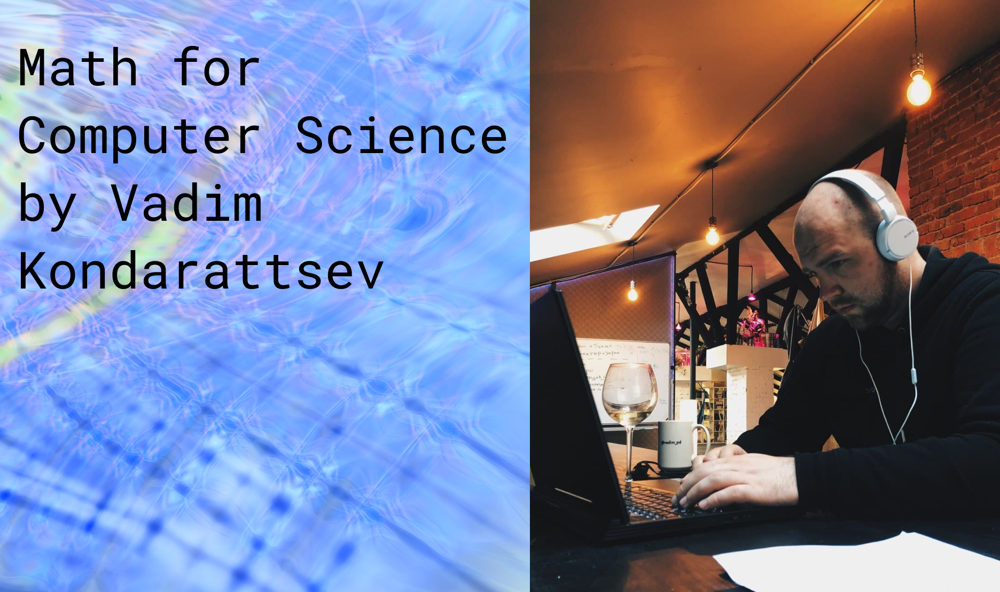
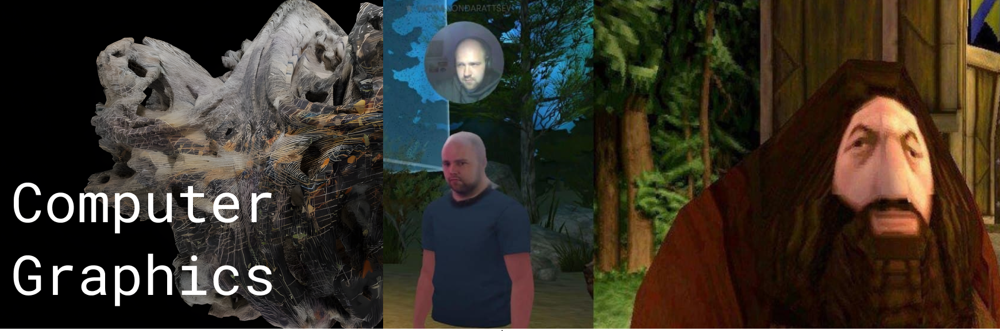
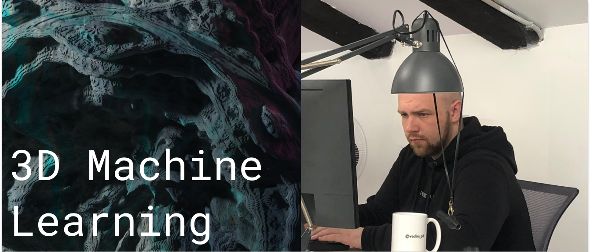
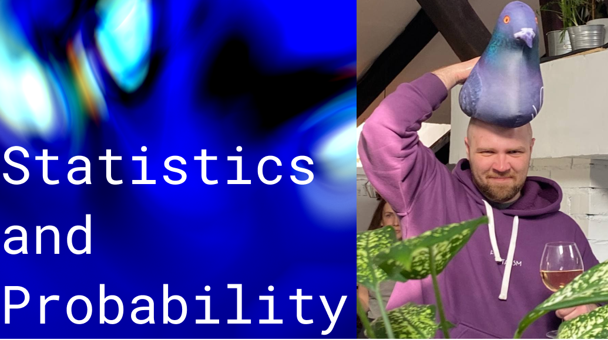
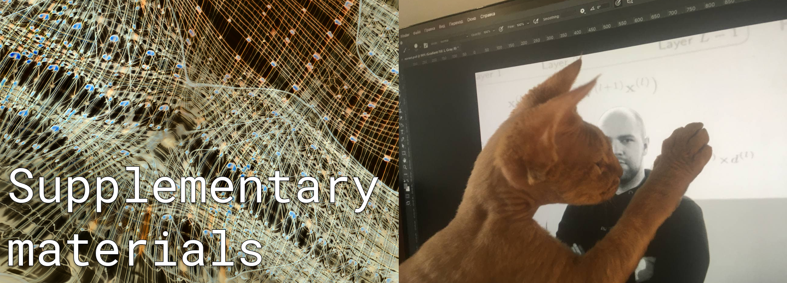

# Math-for-Computer-Scientists

  
  

  

List of usefull materials (books, videos, repos) for bachelor's and master's level.

В данный репозиторий буду заносить полезные материалы по различным курсам + задания на спецкурсы + вопросы и задания к экзаменам по спецкурсам (Фундаментальные концепции искусственного интеллекта `[ФКИИ]` и Современное компьютерное зрение `[3D ML]`.) 

Постижение любой дисциплины условно можно разделить на 5 путей:
 * :mortar_board: Изучение теории;
 * :bulb: Докозательсво теорем и вывод формул/фактов/утверждений;
 * :page_facing_up: Практика *"на бумажке"*;
 * :computer: Практика вычислительная (код и эксперименты);
 * :triangular_ruler: Игра с визуализацией принципов и задач (предмет в мемасах, картинках, графиках, анимациях и прочее).

Далее ко всем источникам и материалам буду стараться прикреплять данные эмодзи как ориентир + если источник это видео-ролик, то он будет маркироваться :video_camera:, а если это github list, то он будет маркироваться :floppy_disk:.

# Linear algebra

## Materials:
- :triangular_ruler::mortar_board:[3b1b: Algebra Series](https://youtube.com/playlist?list=PLZHQObOWTQDPD3MizzM2xVFitgF8hE_ab) => Визуализация базовых понятий линейной алгебры - обязательно к просмотру для лучшего усвоения материала.
- :floppy_disk::mortar_board:[Курс по ЛА от ШАД Яндекс](https://github.com/koddo/shad-prep/blob/master/timestamps.linear_algebra.md)
- :mortar_board: :bulb: :page_facing_up:[Бортаковский и Пантелеев + доп материалы](https://vk.com/wall-186208863_1394) => Основные учебники исполоьзуещиеся на 8 институте МАИ. По ссылке еще полезные альтернативные пособия.
- :page_facing_up:[Пегачкова и Бортаковский - задачник по ЛА](https://dep805.ru/books/bookinfo.php?bookid=117)
- :page_facing_up:[Пегачкова и Бортаковский - задачник по АГ](https://dep805.ru/books/bookinfo.php?bookid=129)
- :mortar_board::bulb::page_facing_up:[Беклемишев - Курс аналитической геометрии и линейной алгебры](http://mathdep.ifmo.ru/wp-content/uploads/2020/09/Курс-аналитической-геометрии-и-линейной-алгебры.-Беклемишев-Д.В..pdf) => Альтернативный к Бортаковскому учебник.
- :mortar_board::bulb::page_facing_up:[Беллман - введение в теорию матриц](https://ikfia.ysn.ru/wp-content/uploads/2018/01/Bellman1969ru.pdf) => Изложение различных аспектов линейной алгебры с точки зрения их применимости в других дисциплинах и в жизни.
- :mortar_board::bulb:[Гантмахер - Теория матриц](https://lib.brsu.by/sites/default/files/books/Гантмахер%20Ф.Р.%20-%20Теория%20матриц.pdf) => Хардкорная книга с глубокой теорией по линейной алгебре.
- :video_camera::mortar_board::bulb:[Алгебра и геометрия ФПМИ  лекторий](https://youtube.com/playlist?list=PL4_hYwCyhAvbl0Q8dZRLJBdzc6j9S_p70)
- :floppy_disk::computer:[Linear_Algebra_With_Python](https://github.com/MacroAnalyst/Linear_Algebra_With_Python)
- :mortar_board::bulb::page_facing_up:[Linear Algebra Done Right](https://link.springer.com/content/pdf/10.1007%2F978-3-319-11080-6.pdf) => Английский учебник (один из нескольких, которые можно найти в списке открытых Springer книжек - ссылка в конце) с большим числом примеров решения задач, примеров практических задач, много картинок и очень хорошо оформлен.

# Computer graphics

## Materials:
- [Компьютерная графика от Кинена Крейна](http://15462.courses.cs.cmu.edu/spring2021/) => Также понятно и круто как и курс по дискретной дифференциальной геометрии от тогоже автора, только про компьютетную графику. Курс англоязычной с практикой и очень хорошими презентациями и лекциями.
# 3D ML

# Optimization

# Statistics & Probability

# Supplementary:

- [50 springer books](https://towardsdatascience.com/springer-has-released-65-machine-learning-and-data-books-for-free-961f8181f189) (можно найти много всего полезного, стоит полистать список)
- :bulb:[Стратегии решения математических задач](https://docs.yandex.ru/docs/view?tm=1641139030&tld=ru&lang=ru&name=01.pdf&text=стратегии%20решения%20математических%20задач%20pdf&url=https%3A%2F%2Fwww.bookvoed.ru%2Ffiles%2F3515%2F21%2F30%2F01.pdf&lr=213&mime=pdf&l10n=ru&sign=b2e0e676628a6edb52023697b40d2fbd&keyno=0&nosw=1&serpParams=tm%3D1641139030%26tld%3Dru%26lang%3Dru%26name%3D01.pdf%26text%3D%25D1%2581%25D1%2582%25D1%2580%25D0%25B0%25D1%2582%25D0%25B5%25D0%25B3%25D0%25B8%25D0%25B8%2B%25D1%2580%25D0%25B5%25D1%2588%25D0%25B5%25D0%25BD%25D0%25B8%25D1%258F%2B%25D0%25BC%25D0%25B0%25D1%2582%25D0%25B5%25D0%25BC%25D0%25B0%25D1%2582%25D0%25B8%25D1%2587%25D0%25B5%25D1%2581%25D0%25BA%25D0%25B8%25D1%2585%2B%25D0%25B7%25D0%25B0%25D0%25B4%25D0%25B0%25D1%2587%2Bpdf%26url%3Dhttps%253A%2F%2Fwww.bookvoed.ru%2Ffiles%2F3515%2F21%2F30%2F01.pdf%26lr%3D213%26mime%3Dpdf%26l10n%3Dru%26sign%3Db2e0e676628a6edb52023697b40d2fbd%26keyno%3D0%26nosw%3D1) (книга школьного уровня, раскрывающая 10 базовых подходов в решении математических задач - крайне полезна для развития математического мышления)
- :bulb:[Доказательства из Книги](https://docs.yandex.ru/docs/view?tm=1641138633&tld=ru&lang=ru&name=Aygner_Dokazatelstva-iz-Knigi_RuLit_Me_647123.pdf&text=доказательства%20из%20книги%20скачать%20pdf&url=https%3A%2F%2Fwww.rulit.me%2Fdata%2Fprograms%2Fresources%2Fpdf%2FAygner_Dokazatelstva-iz-Knigi_RuLit_Me_647123.pdf&lr=213&mime=pdf&l10n=ru&sign=4bc2000beec987010697aee2cb0ec427&keyno=0&nosw=1&serpParams=tm%3D1641138633%26tld%3Dru%26lang%3Dru%26name%3DAygner_Dokazatelstva-iz-Knigi_RuLit_Me_647123.pdf%26text%3D%25D0%25B4%25D0%25BE%25D0%25BA%25D0%25B0%25D0%25B7%25D0%25B0%25D1%2582%25D0%25B5%25D0%25BB%25D1%258C%25D1%2581%25D1%2582%25D0%25B2%25D0%25B0%2B%25D0%25B8%25D0%25B7%2B%25D0%25BA%25D0%25BD%25D0%25B8%25D0%25B3%25D0%25B8%2B%25D1%2581%25D0%25BA%25D0%25B0%25D1%2587%25D0%25B0%25D1%2582%25D1%258C%2Bpdf%26url%3Dhttps%253A%2F%2Fwww.rulit.me%2Fdata%2Fprograms%2Fresources%2Fpdf%2FAygner_Dokazatelstva-iz-Knigi_RuLit_Me_647123.pdf%26lr%3D213%26mime%3Dpdf%26l10n%3Dru%26sign%3D4bc2000beec987010697aee2cb0ec427%26keyno%3D0%26nosw%3D1) => Хардкор версия предыдущий книги для студентов математических специальностей. Есть доказательсва из разных разделов математики.
- :floppy_disk:[From-0-to-Research-Scientist-resources-guide](https://github.com/ahmedbahaaeldin/From-0-to-Research-Scientist-resources-guide) => Github list похожий по структуре на данный с уклоном в глубокое обучение.

# P.S.

Абстрактные картинки для превью разделов взяты из [Behance case of PHYGITALISM](https://www.behance.net/gallery/133337713/1000-Artificial-Intelligence-Art-abstractions).

Для оперативных замечаний, комментариев и предложений все студенты могут написать автору в личку в телеге =).